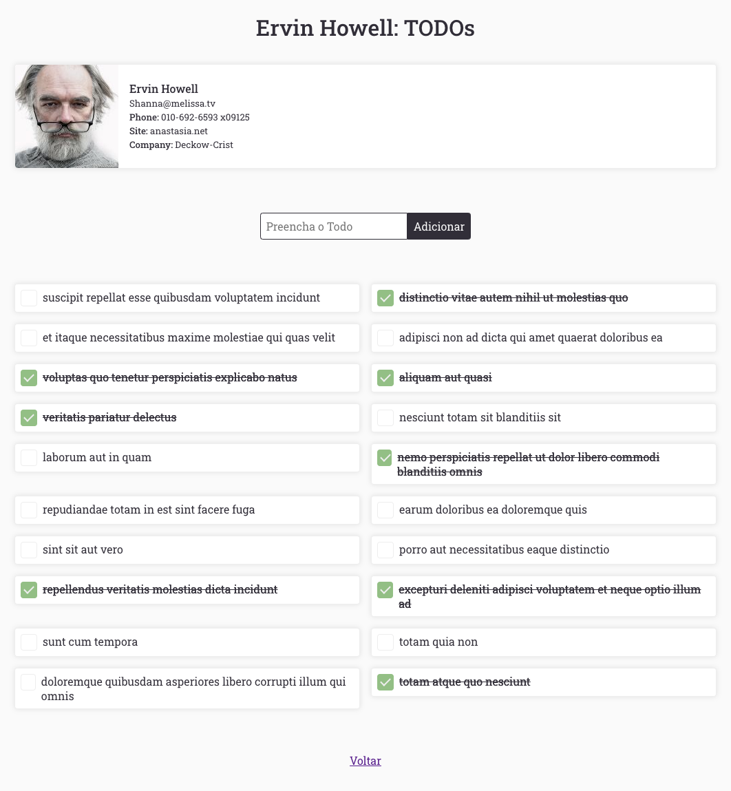

<!-- Info Header -->
### Projeto TODO List
Instalação Padrão React Default, com algumas configurações pre-definidas.

<p>
  <a href="https://cajucomunica.com.br">
    
  </a>
  
</p>
<p>
  <a href="#descrição">Descrição</a> |
  <a href="#prints">Prints</a>
</p>

---

## Visualizar o projeto na IDE:

Para quem quiser visualizar o projeto na IDE do github aperte o ponto no teclado. =)

---

## Descrição

Projeto criado para ajudar no desenvolvimento React, com alguns pacotes instalados e configurações como:

- Typescript
- Path Mapping
- Eslint
- Commit Lint
- Jest
- Husky
- Lint Staged

### Instalação

Para usar basta fazer um git clone e rodar os seguintes comandos:

```
rm -rf .git/
git init
git remote add origin ... (seu repositório) ...
yarn
git add .
git commit -m ''
```

Com esses comandos você vai remover o repositório, iniciar o git e addicionar seu repositório para só depois disso rodar o yarn, pois se rodar o yarn sem o git você vai ter um erro.

Como o Path Mapping está configurado já existe algumas pastas pre-definidas, pode se usar a estrura como está ou modicar, basta alterar o package.json, config-overrides.js e tsconfig.paths.json

## Testes

Para testar basta executar o comando

```
yarn test
```

ou

```
yarn test:coverage
```

Para gerar o coverage

Tem a opção de fazer o lint em todo código, basta executar o comando:

```
yarn eslint:fix
```

Mas como temos o husky instalado basta executar o comando:

```
git commit -m ''
```

Que será executado o lint do código, os testes do código alterado será executado e por fim uma série de perguntas aparecerá no terminal para guiar o tipo de commit.

## Prints

<p align="center">
    
</p>

<p align="center">
    
</p>
